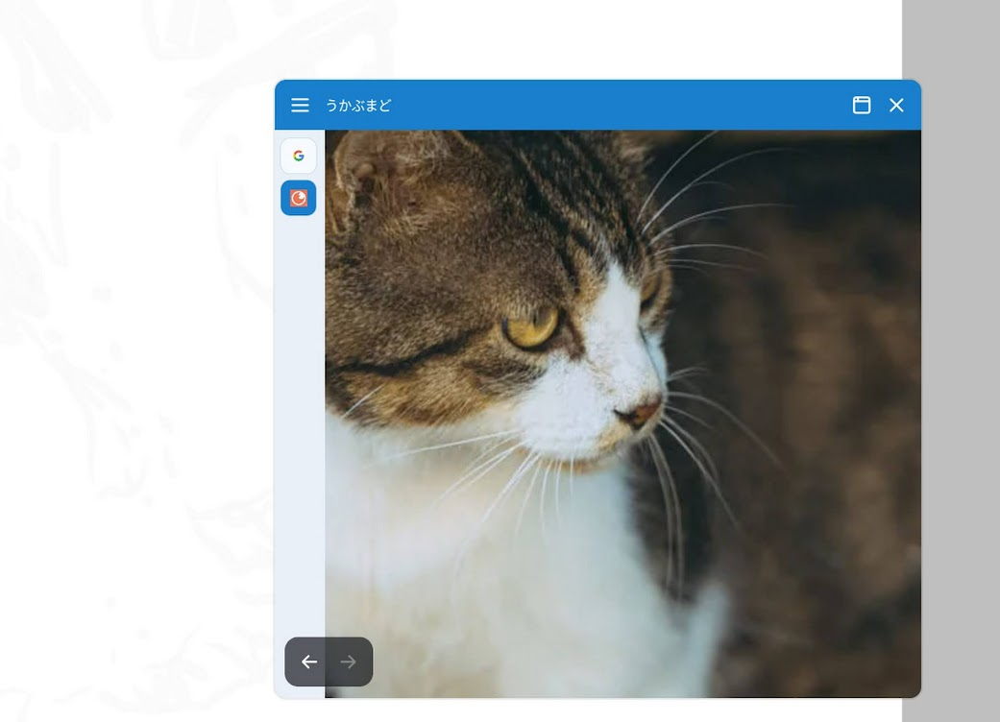

# Android アプリ置き場
* 主に自分用に作成した Android アプリの APK を公開しています
* APKをインストールする場合は、端末側で不明なアプリのインストールを許可してください

## 注意事項
* 一般利用を前提とした配布ではありません
* 端末に対して動作保証はありません
* 要望への対応、不具合対応、サポートの予定はありません
* 本リポジトリで配布している APK の再配布、転載、複製、改変物の配布を禁止します
* リバースエンジニアリング、解析、コピーを禁止します
* 利用によって生じた不利益や損害について、作者は責任を負いません
* 他者に共有する場合は、APK ファイルを直接渡さず、このリポジトリのトップページを案内してください

## フロートブラウザ「うかぶまど」
 
* フローティングで前画面に張り付いて使えるブラウザアプリ
* ブラウザで参考画像を表示しながら絵を描くときなどに便利です
* 左上のメニューをドラッグすることでウィンドウサイズを変えられます
* 広告なし
    * 表示先のWebページの広告はそのまま表示されます
* お気に入り機能、マルチタブ、
* フローティング表示のため最初に権限設定が必要です
* 権限
    * SYSTEM_ALERT_WINDOW: オーバーレイのために必要
    * INTERNET: 通信のために必要
* version: 1.0
* DL:   [最新版 APK をダウンロード](https://github.com/pistatium/android-apps/releases/latest/download/ukabumado-v1.0.apk)
